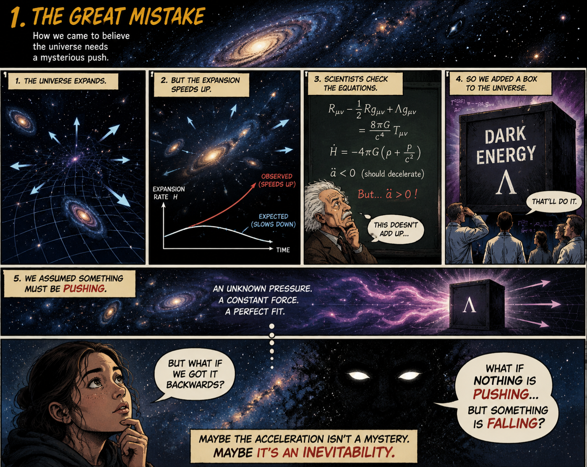
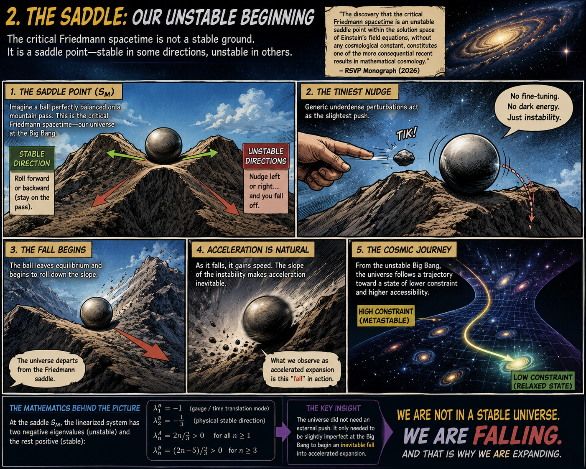
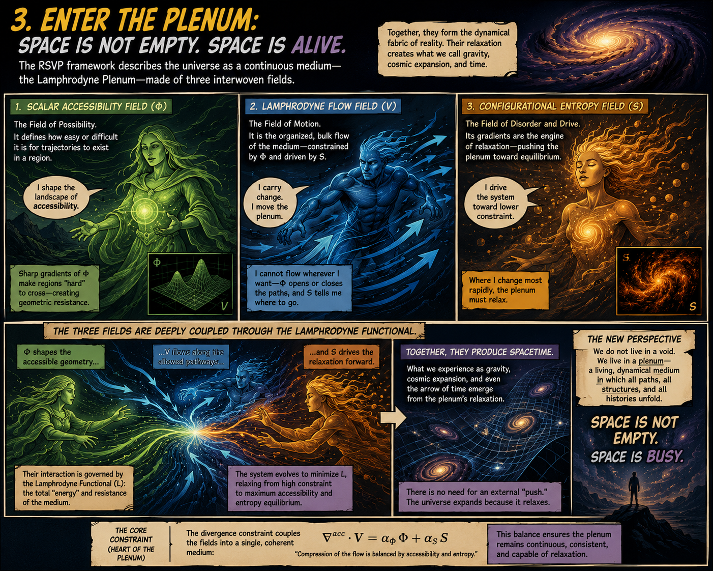
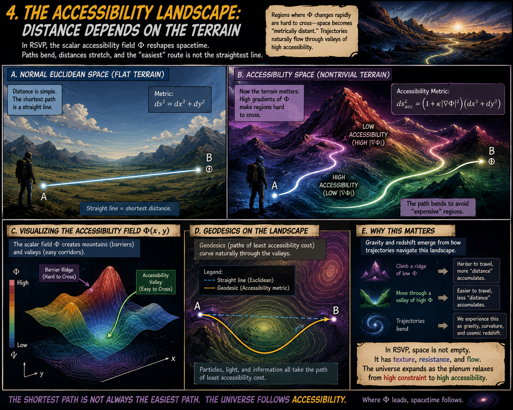
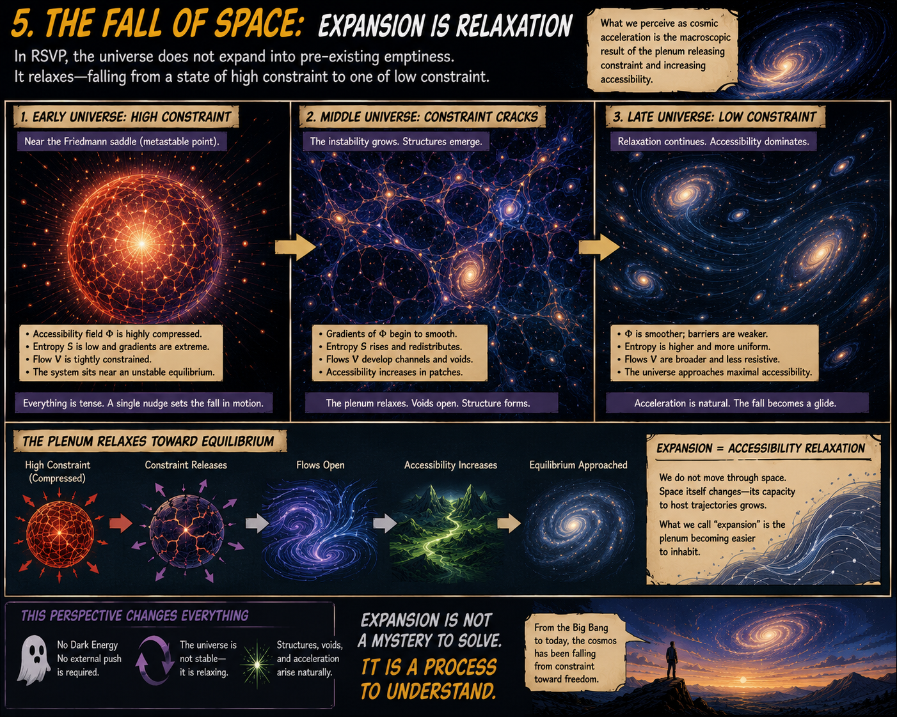
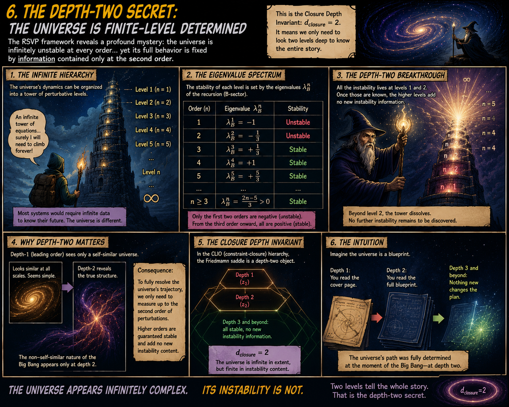
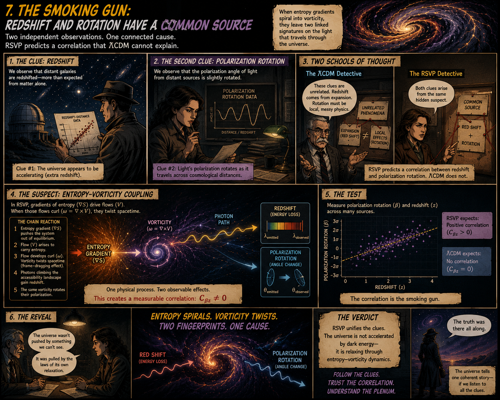
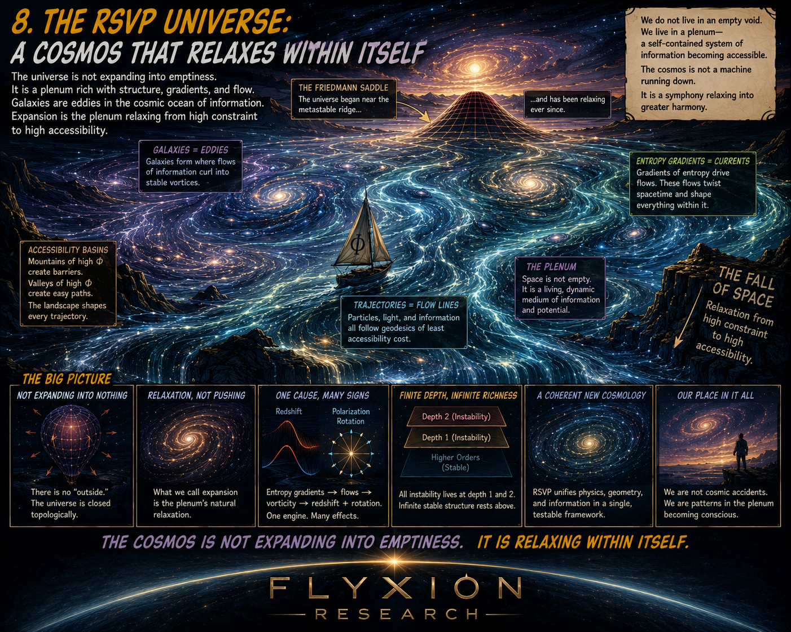

# Numerical Claims Are Conserved Quantities

[Accessibility Relaxation and Friedmann Instability](https://standardgalactic.github.io/cosmology/accessibility-relaxation.pdf)

* [The RSVP Revolution](https://standardgalactic.github.io/cosmology/The_RSVP_Revolution.pdf)

* [The RSVP Blueprint](https://standardgalactic.github.io/cosmology/The_RSVP_Blueprint.pdf)

[Document Perturbation as Constrained Navigation on a Semantic Manifold](https://standardgalactic.github.io/cosmology/docperturb.pdf)

* [Document Physics](https://standardgalactic.github.io/cosmology/Document_Physics.pdf)

* [Audio Overviews](https://standardgalactic.github.io/cosmology/)

