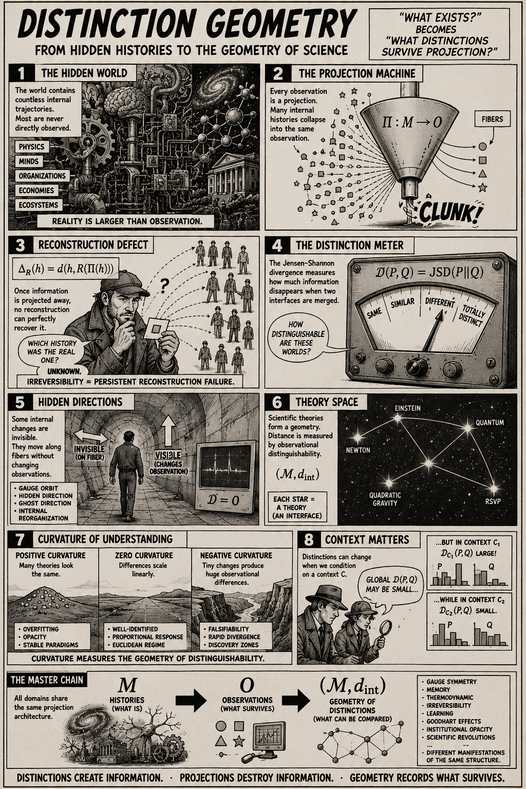

# Philosophy of Cosmology

[Quadradic Gravity as a Derived Interface Theory](https://standardgalactic.github.io/cosmology/working/admissibility-interface.pdf)

* [Notes](https://standardgalactic.github.io/cosmology/working/The_Quadratic_Gravity_Interface.pdf)

* [The Projection Interface](https://standardgalactic.github.io/cosmology/working/The_Projection_Interface.pdf) — *Notes*

[Resource Geometry](https://standardgalactic.github.io/cosmology/working/resource-geometry.pdf)

[Distinction Geometry Core](https://standardgalactic.github.io/cosmology/working/distinction-geometry-core.pdf)

[Foundations of Distinction Geometry](https://standardgalactic.github.io/cosmology/working/flyxion-frameworks.pdf) — *Flyxion Frameworks*

* [The RSVP Plenum](https://standardgalactic.github.io/cosmology/working/The_RSVP_Plenum-notes.pdf)

[Audio Overviews](https://standardgalactic.github.io/cosmology/working/)

# See Also

[Adjunction and Irreversibility](https://standardgalactic.github.io/calculus/adjunction_and_irreversibility.pdf)

[Scalar Irruption via Entropic Differential](https://standardgalactic.github.io/workspace/Scalar%20Irruption%20via%20Entropic%20Differential.pdf)

[Unistochastic Geometry](https://standardgalactic.github.io/alphabet/Unistochastic%20Geometry.pdf)

